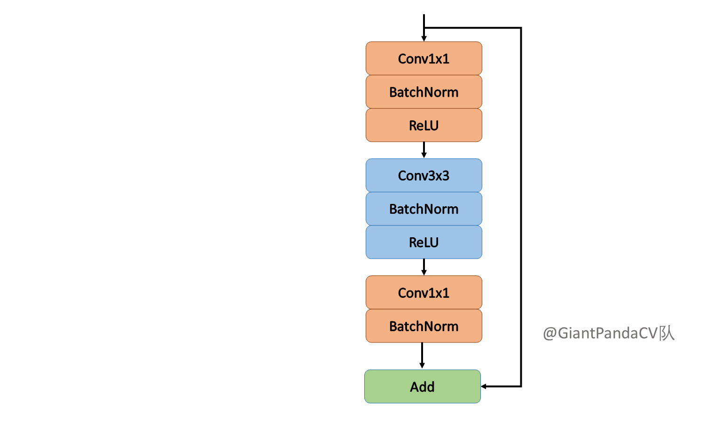
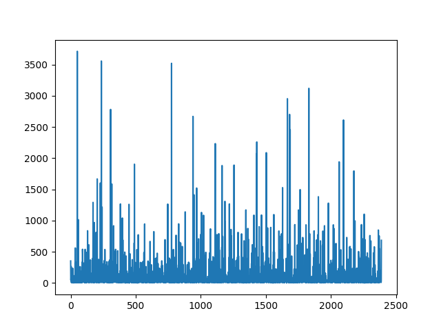

# Res50概述

ResNet50基于ResNet的卷积神经网络

[论文](https://arxiv.org/abs/1810.12348)

## 模型架构

ResNet50的经典模型架构



## 数据集

- RP2K是品览基于零售商品识别能力发布的零售数据集。不同于一般聚焦新产品的数据集，RP2K收录了超过50万张零售商品货架图片，商品种类超过2000种，该数据集是目前零售类数据集中产品种类数量TOP1，同时所有图片均来自于真实场景下的人工采集。
- 下图对该数据集各个类别中图片数量进行了统计，其中other文件中包含了1万张图片，严重影响了数据集的平衡，所以在处理数据集的时候选择从1万张图片中随机采样2262张图片保留。处理完成后，所有的图片分布如下，依然存在长尾分布的问题。



## 特性

## 混合精度

采用[混合精度](https://www.mindspore.cn/tutorial/training/en/master/advanced_use/enable_mixed_precision.html)的训练方法使用支持单精度和半精度数据来提高深度学习神经网络的训练速度，同时保持单精度训练所能达到的网络精度。混合精度训练提高计算速度、减少内存使用的同时，支持在特定硬件上训练更大的模型或实现更大批次的训练。
以FP16算子为例，如果输入数据类型为FP32，MindSpore后台会自动降低精度来处理数据。用户可打开INFO日志，搜索“reduce precision”查看精度降低的算子。

# 环境要求

- 硬件：昇腾处理器（Ascend）
    - 使用昇腾处理器来搭建硬件环境。

- 框架
  - [MindSpore](https://www.mindspore.cn/install) 1.5.1

- 如需查看详情，请参见如下资源：

  - [MindSpore教程](https://www.mindspore.cn/tutorial/training/en/master/index.html)

  - [MindSpore Python API](https://www.mindspore.cn/doc/api_python/en/master/index.html)

## 脚本说明

## 脚本和样例代码

```python
├── GENet_Res50
  ├── Readme.md
  ├── scripts
  │   ├──run_distribute_train.sh # 使用昇腾处理器进行八卡训练的shell脚本
  │   ├──run_train.sh    # 使用昇腾处理器进行单卡训练的shell脚本
  │   ├──run_eval.sh  # 使用昇腾处理器进行评估的单卡shell脚本
  ├──src
  │   ├──config.py # 参数配置
  │   ├──dataset.py # 创建数据集
  │   ├──lr_generator.py # 配置学习速率
  │   ├──crossentropy.py # 定义GENet_Res50的交叉熵
  │   ├──GENet.py # GENet_Res50的网络模型
  │   ├──GEBlock.py # GENet_Res50的Block模型
  ├── train.py # 训练脚本
  ├── eval.py # 评估脚本
  ├── export.py
```

### 脚本参数

在config.py中可以同时配置训练参数和评估参数。

- 配置GENet_Res50和ImageNet2012数据集。

  ```python
    "class_num": 1000,
    "batch_size": 256,
    "loss_scale": 1024,
    "momentum": 0.9,
    "weight_decay": 1e-4,
    "epoch_size": 150,
    "pretrain_epoch_size": 0,
    "save_checkpoint": True,
    "save_checkpoint_epochs": 10,
    "keep_checkpoint_max": 5,
    "decay_mode":"linear",
    "save_checkpoint_path": "./checkpoints",
    "hold_epochs": 0,
    "use_label_smooth": True,
    "label_smooth_factor": 0.1,
    "lr_init": 0.8,
    "lr_end": 0.0
  ```

## 训练过程

### 用法

- 晟腾（Ascend）:

```python
  八卡：bash run_distribute_train.sh [RANK_TABLE_FILE] [DATASET_PATH] [MLP] [EXTRA][PRETRAINED_CKPT_PATH]\（可选)
  单卡：bash run_train.sh [DATASET_PATH] [MLP] [EXTRA] [DEVICE_ID] [PRETRAINED_CKPT_PATH](optional)
```

### 启动

```python
  # 训练示例
  # 八卡：
  Ascend: bash run_distribute_train.sh ~/hccl_8p_01234567_127.0.0.1.json /data/imagenet/imagenet_original/train True True
  # 单卡：
  Ascend: bash run_train.sh /data/imagenet/imagenet_original/val True True 5
```

### 结果

八卡训练结果保存在示例路径中。检查点默认保存在`./train_parallel$i/`，训练日志重定向到`./train/device$i/train.log`，单卡训练结果保存在./train_standalone下，内容如下：

```python
epoch: 1 step: 5000, loss is 4.8995576
epoch: 2 step: 5000, loss is 3.9235563
epoch: 3 step: 5000, loss is 3.833077
epoch: 4 step: 5000, loss is 3.2795618
epoch: 5 step: 5000, loss is 3.1978393
```

## 评估过程

### 用法

使用python或shell脚本开始训练。shell脚本的使用方法如下：

- 昇腾（Ascend）：bash run_eval.sh [DATASET_PATH] [CHECKPOINT_PATH] [MLP] [EXTRA] [DEVICE_ID]

### 启动

```shell
# 推理示例
  shell:
      Ascend: sh run_eval.sh Ascend ~/imagenet/val/ ~/train/GENet-150_625.ckpt True True 0
```

> 训练过程中可以生成检查点。

### 结果

推理结果保存在示例路径中，可以在`./eval/log`中找到如下结果：

```python
result: {'top_5_accuracy': 0.9412860576923077, 'top_1_accuracy': 0.7847355769230769}
```

