# 基于MindSpore AI框架实现零售商品识别

[TOC]

## 1. 赛题任务

本赛题中，参赛团队将设计算法对零售商品进行识别和分类，选手需要通过分析训练集中标注数据的特点，构建AI模型，对测试集中测试数据进行识别和分类。

参赛者在规定时间内须使用MindSpore AI计算框架进行模型的设计、训练和预测，不得使用任何其他框架参赛。

对于预训练模型，大赛只允许：
- 使用MindSpore官方开源的预训练模型
- 通过监督/自监督/无监督方法对比赛训练集（不允许用比赛测试集和外部数据集）训练得到的模型作为预训练模型，这里要求获取预训练模型的方法可复现

## 2. 数据分析

RP2K是品览基于零售商品识别能力发布的零售数据集。不同于一般聚焦新产品的数据集，RP2K收录了超过50万张零售商品货架图片，商品种类超过2000种，该数据集是目前零售类数据集中产品种类数量TOP1，同时所有图片均来自于真实场景下的人工采集，针对每种商品，提供了十分详细的注释。

- 长尾分布特点明显

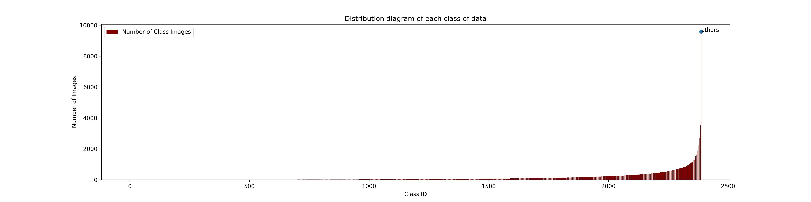

- 数据长宽比分布失衡 

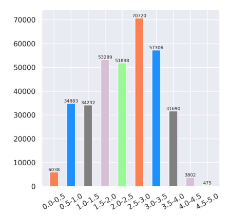

- 错误标注问题

- 其他具有挑战性的问题

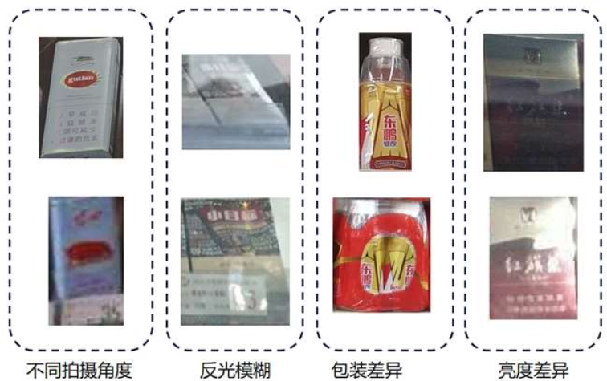

- 细粒度识别问题

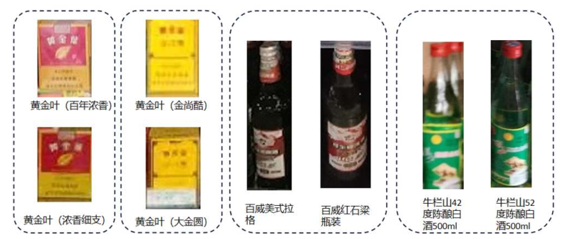

## 3.数据处理

（1）Structure-Retention Resize策略，保留原有的结构化信息。性能上能够提升3个百分点。

（2）测试了Cutout,AutoAug, Random Erasing等策略。

（3）后处理使用了FixRes的技巧。

详情参考：[【分类技巧】Fixing the train-test resolution discrepancy](https://blog.csdn.net/DD_PP_JJ/article/details/121202386)

## 4. 环境要求

- 硬件：昇腾处理器（Ascend）GTX 3090Ti

- 框架
  - [MindSpore](https://www.mindspore.cn/install)

- 如需查看详情，请参见如下资源：

  - [MindSpore教程](https://www.mindspore.cn/tutorial/training/en/master/index.html)

  - [MindSpore Python API](https://www.mindspore.cn/doc/api_python/en/master/index.html)

## 5. 模型架构说明

**SE_ResNeXt50**是ResNeXt50的一个变体。ResNeXt50是一个简单、高度模块化的图像分类网络架构。

ResNeXt50的设计为统一的、多分支的架构，该架构仅需设置几个超参数。此策略提供了一个新维度，即“基数”（转换集的大小），它是深度和宽度维度之外的一个重要因素

Squeeze & Excitation Module 能够让模型自适应调整各个通道的重要程度，学习通道之间的相关性，提升模型的感受野。

SE_ResNeXt整体网络架构如下：

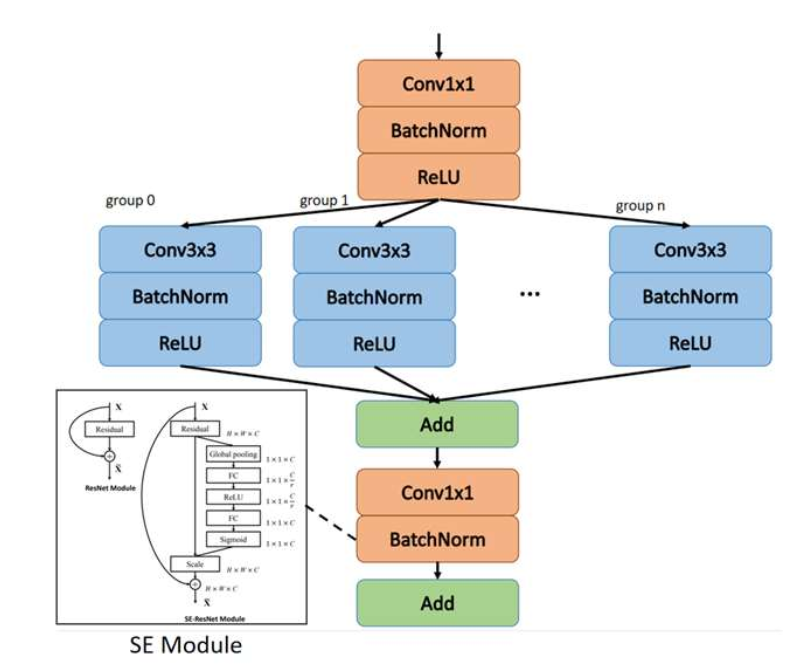

**Inception_resnet_v2**:  是Inception系列经典模型，由浅至深是有Inception-ResNet-A,Inception-ResNet-B,Inception-ResNet-C组成，B中使用了7x1和1x7大卷积核可以有效提升模型感受野。

模型优势：可以在更少的Epoch内部达到更高的准确率。

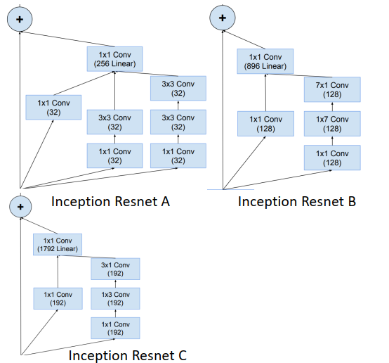

**ResNet50_BAM**:  BottleNeck Attention Module 是通道注意力机制和空间注意力机制的综合，并行使用两种注意力及价值。其中，通道注意力机制使用的是SE，空间注意力则同各国特征图提取Spatial Attention，将两者结合起来队员图进行特征重标定。

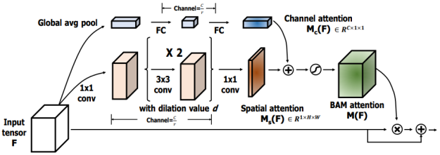

模型进一步改进：提出了SEResNet50_wider等wider系列模型，进行了模型容量扩充。

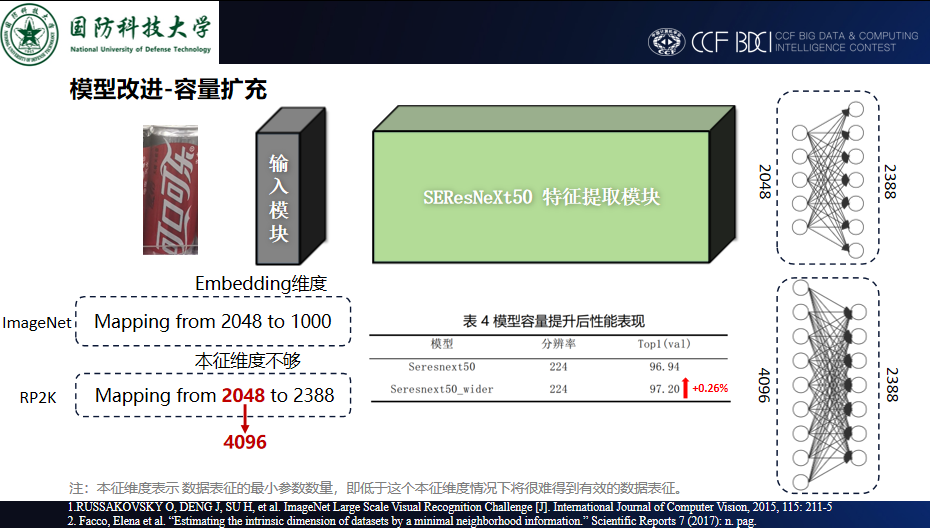

## 6. 消融实验

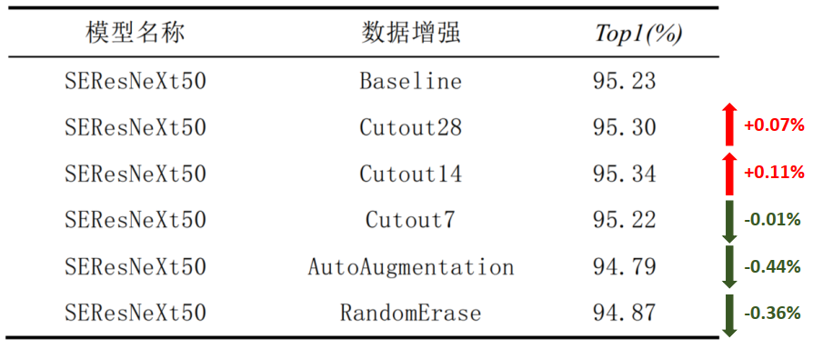

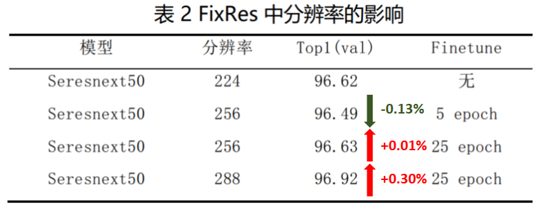

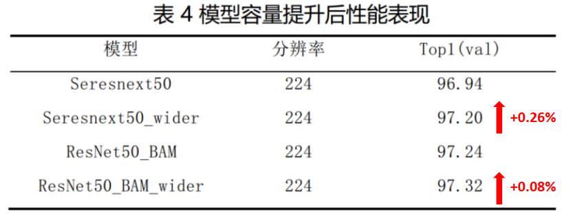

## 7. 经验总结

（1）针对长宽比不均匀的数据，使用Structure-Retention Resize方法非常有效。

（2）小的Batch Size训练得到的模型的泛化能力更强。

（3）训练更长Epoch可以获得性能的提升，但迫于时间限制，并没有采取这个方案

（4）网络设计方面应选择在深层使用更大Kernel 的卷积操作或者使用注意力模块来增大感受野，有助于模型性能提升。

## 8. 类别扩展

[敬请期待]

